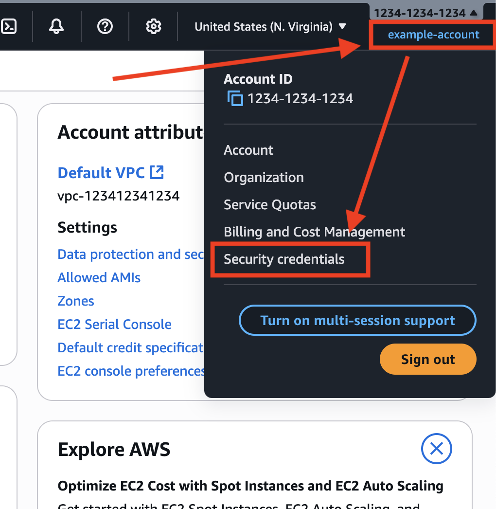
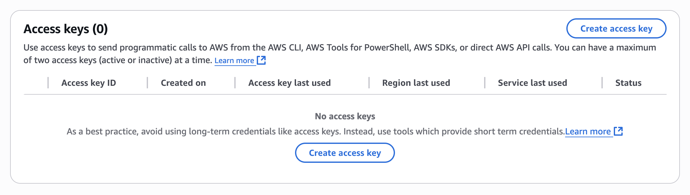
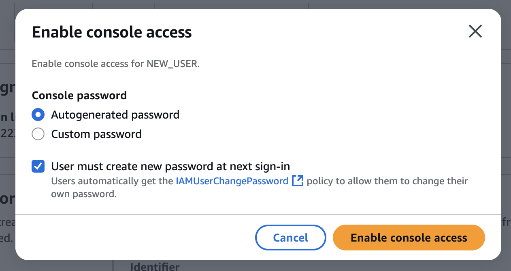
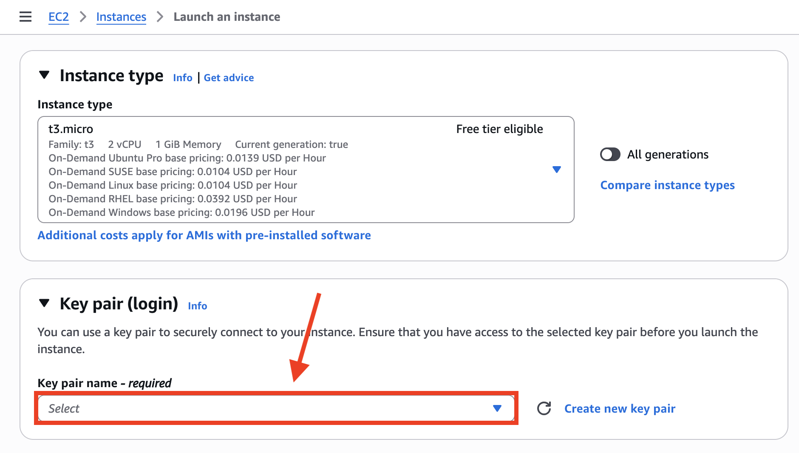
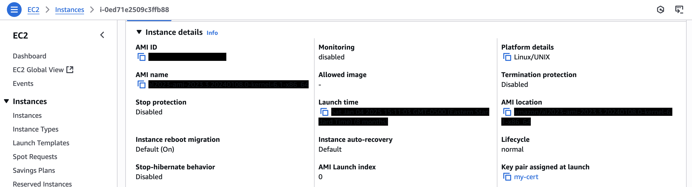

# AWS Best Practices
For all new and existing AWS projects, the following are the minimum best practices I can think for access.

## 1. Immediately Remove Access Key
When you first create an account, if it creates an access key, delete it at:
https://console.aws.amazon.com/iam/home#security_credential

1. If link does not work, this is found under the user link in the header then selecting "**Security Credentials**".

  
<i>(view Screenshot)</i>

  

2. Then go down to AWS "**Access Keys**" and ensure it is deleted (if one was made automatically).

  
<i>(view Screenshot)</i>

  

## 2. Setup MFA (Multi-Factor Authentication)
While still on the "[Security Credentials page](https://console.aws.amazon.com/iam/home#security_credential)" setup 1.) both a **Passkey** for the computer you used most and 2.) MFA through the "Google **Authenticator app**" or similar".

  
<i>(view Screenshot)</i>

  

## 3. Setup CloudTrail to Track/Record Account Activity
1. Navigate to **[AWS CloudTrail](https://console.aws.amazon.com/cloudtrail)**.
2. Select "**Create Trail**"
3. Give it name, ex "management-events"
4. Create new S3 bucket to store the logs
5. **Save** then can see all actions that happen on your account whenever you return back to **[AWS CloudTrail](https://console.aws.amazon.com/cloudtrail)**.

  
<i>(view Screenshot)</i>

  Example after doing a few things:
  

## 4. Create IAMM Role for all dev/IT work
The Idea/Thinking:
- **Root User** - will have access to billing, route53, control of users, and literally everything else but won't have keys setup to SSH into your EC2 resources.
- **IAM User** - will be the only account you ever use regularly and is the account that will have SSH access to the EC2 resources.

1. Go to "[AWS IAM](https://console.aws.amazon.com/iam/home#/groups)" > **User Groups** > then "**Create Group**".
2. Call it ex. "EC2PowerUser"
3. Add Permissions:
  - AmazonEC2FullAccess
  - EC2InstanceConnect
4. Then "**Create new [IAM User](https://console.aws.amazon.com/iam/home#/users)**"
5. Assign user to the group you made, ex: "EC2PowerUser"
6. After saving, grant user console access so they can turn on/off the EC2 instances when needed BUT be sure to **select that the password must change on login**.
  

    
<i>(view Screenshot)</i>

    
  

7. Then give the user (if not yourself) the credentials.
  

    
<i>(view Screenshot)</i>

    
  

8. "**If it is yourself**", then setup Multi-Factor-Authentication for this user too. Ex. both for the most common computer used and on an authenticator app.
  

    
<i>(view Screenshot)</i>

    
  

## 5. Create Key Pair for EC2 for IAM user
1. Go to **Key Pairs**, then select to create one.
2. Give it a name, select "**RSA**", "**.pem**".
3. Then based on the state of your EC2, do one of the following:

### Add Cert to new EC2

  
<i>(view Steps)</i>

  1. When you launch the new EC2 instance, there will be an option there to assign it to a cert.
  
  2. Then when you launch it, will always shown "**Key pair assigned at launch**".
  

### Add Cert to existing EC2

  
<i>(view Steps)</i>

  1. SSH into it using the key it already supports (if applicable)
  2. Add new .pem cert to _________

### SITUATION: How to add if you deleted old SSH cert

  
<i>(view Steps)</i>

  Either clone it via AMI or detach EBS by doing ________

