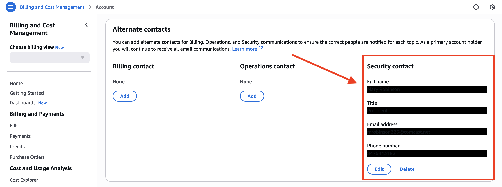

# AWS Best Practices
For all new and existing AWS projects, the following are the minimum best practices I can think for access.

## 1. Immediately Remove Access Key <strong>(Cost: <i>FREE</i>)</strong>
When you first create an account, if it creates an access key, delete it at:
https://console.aws.amazon.com/iam/home#security_credential

<ol>
  <li>If link does not work, this is found under the user link in the header then selecting "<b>Security Credentials</b>".
    

      
<i>(view Screenshot)</i>

      
    

  </li>
  <li>Then go down to AWS "<b>Access Keys</b>" and ensure it is deleted (if one was made automatically).
    

      
<i>(view Screenshot)</i>

      
    

  </li>
</ol>

## 2. Add Alternate Security Contact <strong>(Cost: <i>FREE</i>)</strong>
Under "<b>Billing and Cost Management</b>" open "<b><a href="http://console.aws.amazon.com/billing/home#account">Account</a></b>". It is strongly recommended by AWS that you add a "alternate security contact" to respond in the event of a breach or other security problem.
  

    
<i>(view Screenshot)</i>

    
  

## 3. Setup MFA (Multi-Factor Authentication) <strong>(Cost: <i>FREE</i>)</strong>
While still on the "[Security Credentials page](https://console.aws.amazon.com/iam/home#security_credential)" setup 1.) both a <b>Passkey</b> for the computer you used most and 2.) MFA through the "Google <b>Authenticator app</b>" or similar".
  

    
<i>(view Screenshot)</i>

    
  

## 4. Setup CloudTrail to Track/Record Account Activity <strong>(Cost: <i>FREE for logging in/doing actions <4999 times/month</i>)</strong>
<ol>
  <li>Navigate to <b><a href="https://console.aws.amazon.com/cloudtrail">AWS CloudTrail</a></b>.</li>
  <li>Select "<b>Create Trail</b>"</li>
  <li>Give it name, ex "management-events"</li>
  <li>Create new S3 bucket to store the logs</li>
  <li><b>Save</b> then can see all actions that happen on your account whenever you return back to <a href="https://console.aws.amazon.com/cloudtrail">AWS CloudTrail</a>.
    

      
<i>(view Screenshot)</i>

      Example after doing a few things:
      
    

  </li>
</ol>

## 5. Create IAM Role for all dev/IT work <strong>(Cost: <i>FREE</i>)</strong>
The Idea/Thinking:
- **Root User** - will have access to billing, route53, control of users, and literally everything else but won't have keys setup to SSH into your EC2 resources.
- **IAM User** - will be the only account you ever use regularly and is the account that will have SSH access to the EC2 resources.

<ol>
<li>Go to "<b><a href="https://console.aws.amazon.com/iam/home#/groups">AWS IAM</a></b>" > <b>User Groups</b> > then "<b>Create Group</b>".</li>
<li>Call it ex. "EC2PowerUser"</li>
<li>Add Permissions:
  <ul>
    <li>AmazonEC2FullAccess</li>
    <li>EC2InstanceConnect</li>
  </ul>
</li>
<li>Then "<b>Create new [IAM User](https://console.aws.amazon.com/iam/home#/users)</b>"</li>
<li>Assign user to the group you made, ex: "EC2PowerUser"</li>
<li>After saving, grant user console access so they can turn on/off the EC2 instances when needed BUT be sure to <b>select that the password must change on login</b>.
  

    
<i>(view Screenshot)</i>

    
  

</li>
<li>Then give the user (if not yourself) the credentials.
  

    
<i>(view Screenshot)</i>

    
  

</li>
<li>"<b>If it is yourself</b>", then setup Multi-Factor-Authentication for this user too. Ex. both for the most common computer used and on an authenticator app.
  

    
<i>(view Screenshot)</i>

    
  

</li>
</ol>

## 6. Create Key Pair for EC2 for IAM user <strong>(Cost: <i>FREE</i>)</strong>
1. Go to **Key Pairs**, then select to create one.
2. Give it a name, select "**RSA**", "**.pem**".
3. Then based on the state of your EC2, do one of the following:

### OPTION 1 - Add Cert to new EC2

  
<i>(view Steps)</i>

  <ol>
    <li>When you launch the new EC2 instance, there will be an option there to assign it to a cert.
    </li>
    <li>Then when you launch it, it will always be shown under: "<b>Key pair assigned at launch</b>".
    </li>
  </ol>

### OPTION 2a - Add Cert to existing EC2

  
<i>(view Steps)</i>

  <ol>
    <li>SSH into it using the key it already supports (if applicable)</li>
    <li>Add new .pem cert to _________</li>
  </ol>

### OPTION 2b - Add Cert to existing EC2 if you deleted old SSH cert

  
<i>(view Steps)</i>

  Either clone it via AMI or detach EBS by doing ________

## 7. Setup Cloudwatch to Email you alerts
Ideally, because you will only ever be using the IAM user (NOT the root user account) for daily things, setup a [Cloudwatch alert](http://console.aws.amazon.com/cloudwatch) for any login and/or also the more severe actions on the root user. If you need to log in for checking billing or setting up new IAM users, it's all fine and good, you just will get an email each time so you know 100% every time there is something truly suspicious.

## 8. *OPTIONAL* Enable AWS GuardDuty <strong>(Cost: NOT Free)</strong>
[GuardDuty](http://console.aws.amazon.com/guardduty) monitors threats against everything but to save cost you can set it up for just your Amazon Simple Storage Service (Amazon S3) resources. If enabled it will analyze CloudTrail management events and CloudTrail S3 data events, monitoring access, and activity in your S3 buckets for malicious files being added or anything else suspicious.

## 9. Lock down all EC2s to be within a VPC
TBD
